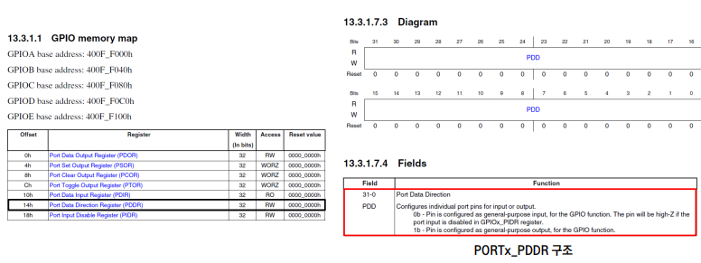

## Switch Example

### :sa:Switch를 이용한 LED on/off 제어

1. 새로운 예제를 위한 프로젝트를 생성한다
2. 원하는 동작을 위해 레지스터와 메모리에 직접 접근해서 값을 써야 한다.
3. 해당 예제에서는 LED를 사용해야 하기 때문에 Board Schematic에서 LED 정보를 파악한다.
4. LED가 연결된 GPIO 모듈의 메모리맵을 분석한다.
5. 보드 정보를 포함한 프로젝트를 생성했을 때, 해당 보드의 메모리 맵 정보가 헤더파일로 추가되기 때문에 이를 참고할 수 있다.
6. 분석 결과를 활용해 임베디드 프로그래밍을 한다.

### :one: Schematic 분석

:heavy_check_mark:해당 보드의 Schematic을 확인했을 때, User가 사용할 수 있는 LED는 PTD0/PTD15/PTD16 핀에 연결되어 있고, 각각 Blue, Red, Green이다.

### :two: Data sheet 분석

#### (1) IO 설정

:heavy_check_mark:Switch를 사용하기 위해 연결된 핀의 IO설정이 필요하다.

1. PCC 및 Peripheral Register를 통해 Peripheral Clock 및 Pheripheral 설정을 한다(기본설정을 따름)
2. PCC_PORTx Register를 통해 핀을 포함하는 Port의 Clock설정을 한다.
3. PORTx_PCRn을 통해 해당 핀의 Peripheral Pin설정을 한다.

> 12.1.3 I/O 설정 순서
> 1.주변장치의 핀이 3상 상태인지 확인합니다(기본값은 리셋되지 않음).
> 2.주변기기 클록 컨트롤러 레지스터(PCC) 및 주변기기별 클록 구성에서 주변기기 클록을 초기화합니다.
> 3.주변기기를 구성합니다.
> 4.주변장치 클럭 컨트롤러 레지스터(PCC_PORTx)에서 주변장치 핀의 포트 클럭을 초기화합니다.
>
> <cite>부록07_S32K-Reference%20Manual.pdf</cite>

#### (2) Port Clock 설정

:heavy_check_mark:PCC_PORTx Register에서 CGC bit를 set하여 Clock enable 설정을 한다.

#### (3) Peripheral Pin 설정

:heavy_check_mark:PORTx_PCRn에서 MUX bits를 설정하여 해당 핀이 GPIO로 사용될 수 있도록 한다.

#### (4) GPIO 설정

:heavy_check_mark:GPIO로 사용되는 핀은 다음과 같은 특징을 가진다.

1. PDDR을 통해 Input/Output 설정을 한다.
2. Input으로 설정된 경우, PDIR을 통해 핀의 Logic Level을 읽을 수 있다.
3. Output으로 설정된 경우, PDOR에 대응하는 set/clear/toggle register를 통해 Logic Level을 쓸 수 있다.

> 13.2.1 특징
>
> GPIO 모듈의 특징은 다음과 같습니다:
>
> - 모든 디지털 핀 멀티플렉싱 모드에서 포트 데이터 입력 레지스터 표시
> - 포트 데이터 출력 레지스터(PDOR)와 해당 설정/클리어/토글(PSOR/PCOR/PTOR) 레지스터 포함
> - 포트 데이터 방향 레지스터
>
> <cite>부록07_S32K-Reference%20Manual.pdf</cite>

### (5) Output설정

:heavy_check_mark:GPIO로 사용되는 핀의 Input/Output 설정을 한다. LED는 Output으로 설정해야 한다.

### :three:프로그래밍

1. LED가 연결된 핀에 대한 IO 설정을 한다.

2. LED가 연결된 핀에 대한 GPIO 설정 (Output 설정)을 한다.

3. 동작에 따라 'main'함수를 구현한다.

4. 빌드

   

5. 디버그

   

   

   

6. 다운로드

