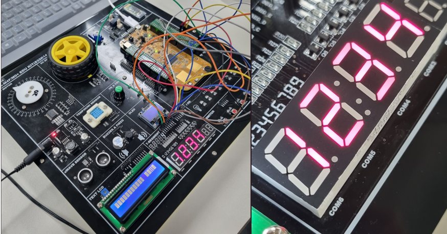

### 4자리 숫자 표시: 1234

result>

insight>

세그먼트 셀렉트를 4개중에 하나만 쓸지라도 코드상으로는 1의 자리가 11번핀에 연결되도록 해주어야 불이 정상적으로 들어오는 것을 확인하였다.(그냥 받아들이자)

- 천의 자리는 8번핀에 연결
- 백의 자리는 9번핀에 연결
- 십의 자리는 10번핀에 연결
- 일의 자리는 11번핀에 연결

