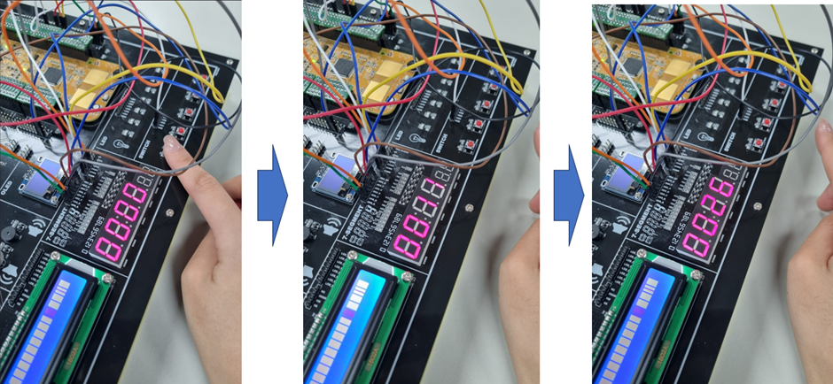

### 초시계 프로그램 작성 및 실행, push button ‘On’시 리셋

result>

###### 푸시버튼을 누르기 전)

값이 계속 증가하는 것을 알 수 있다 ( ... -> 59 -> 60 -> 61 -> ... -> 71 -> 72 -> ... -> 100 -> ...)

###### 푸시버튼을 누른 후)

푸시 버튼을 누른 후, 0으로 초기화되고 나서 다시 값이 증가하는 것을 알 수 있다.

