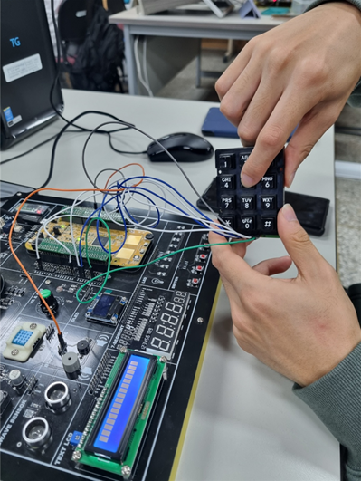
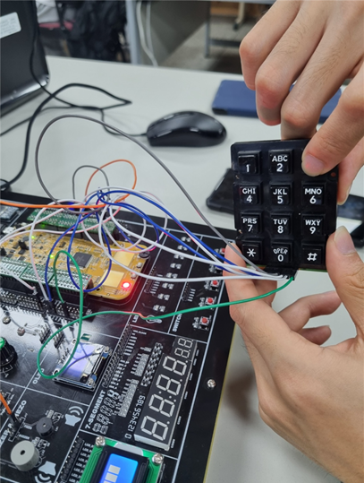

### 1)Keypad를 조작하여 모듈 제어하기

Keypad를 조작하여 모듈 제어하기
-GPIO에 Keypad를 연결하고,
-'5'번키를 누를때 PIEZO 'On'
-'3'번키를 누를때 빨간색 LED 'On'

result>

-'5'번 키를 눌렀을때 'PIEZO-On'이 되어 소리가 들리는 것을 확인하였다.

-'3'번 키를 눌렀을 때 빨간색 LED가 'On'이 되어 불이 켜지는 것을 확인하였다.

