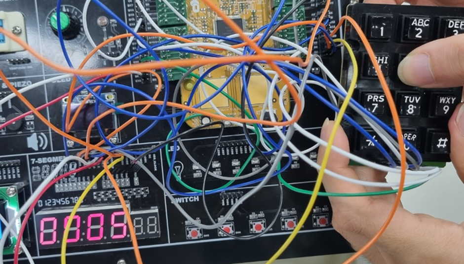

### 2)Keypad에 입력한 번호를 세그먼트에 출력_1

-Keypad에 입력한 번호를 세그먼트에 하나씩만 출력
(5를 입력하고 6을 입력하면 기존에 5가 클리어되고 6이 세팅됨)

result>

- Keypad에 5를 입력했을때 7-세그먼트에 5가 출력되는 것을 확인하였다.

- Keypad에 8을 입력했을때 7-세그먼트에 8이 출력되는 것을 확인하였다.

※각 keypad line에 출력신호를 주어 선택을 하고, 해당 라인에서 원하는 버튼을 클릭하면 그 버튼에 상응하는 값이 Kbuff에 담기는 원리로 동작한다.

### 2)Keypad에 입력한 번호를 세그먼트에 출력_2

-Keypad 입력한 숫자 순서대로 세그먼트에 최대 4자리 출력하기
(5를 입력하고 6을 입력하면 기존에 5가 십의 자리로 이동하고 6이 일의자리에 배치됨)

- Keypad에 112를 눌렀을 때 7-세그먼트에 112가 출력되는 것을 확인하였다.

- Keypad에 1234를 순차적으로 눌렀을 때 7-세그먼트에 1234가 출력되는 것을 확인하였다.

