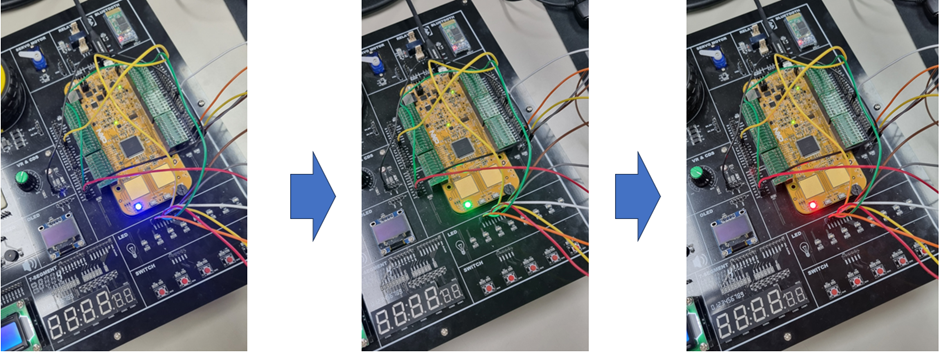

### 1)가변저항 ADC를 이용해서 내부LED 출력에 변화주기

- ADC값에 따라 내장된 B[0], R[15], G[16] 색이 변경됨.

가변저항에 대해서 VR핀에 케이블을 연결한 후 시계방향으로 돌려보면서 저항값이 바뀌면 그 수치가 0에서 5000까지로 변하는 특성을 갖고 있고, 그 특성을 이용하여 LED가 BLUE->GREEN->RED로 변하는 효과를 구현하는 원리를 알 수 있다.

